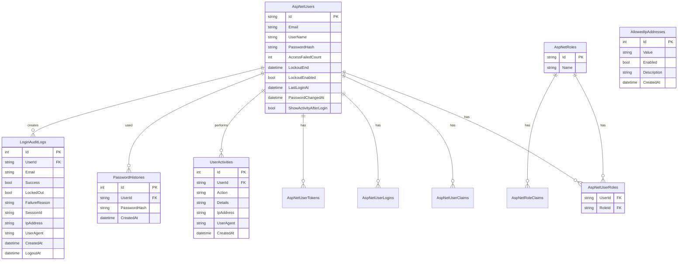

# Diagram ER

Poniższy diagram pokazuje najważniejsze tabele Identity oraz tabele dodane w projekcie.

## Tabele niestandardowe

| Tabela | Cel |
|---|---|
| `UserActivities` | Historia czynności użytkownika widoczna po zalogowaniu. |
| `PasswordHistories` | Ostatnie skróty haseł używane do blokowania powtórzeń. |
| `LoginAuditLogs` | Rejestr prób logowania oraz czasu wylogowania. |
| `AllowedIpAddresses` | Opcjonalna lista adresów IP dopuszczonych do systemu. |

## Diagram przy użyciu Ridera

